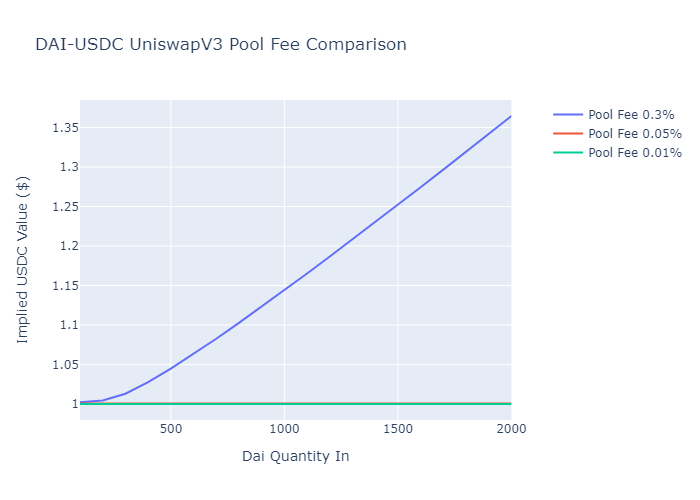
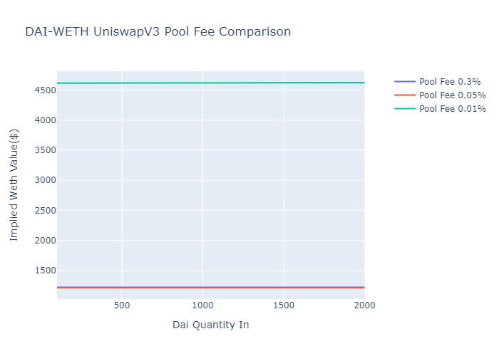

# UniswapV3 Pool Fee Analysis

I started learning how to set up a solidity contract and some python scripts that I could use to do simple swaps between tokens using UniswapV3. Odd behavior first started when I started doing multihops, as demoed in the example contracts provided by Uniswap. The example swaps from DAI to USDC to WETH. I noticed that when more than ~$100 of DAI was used as the amount in, the output WETH was much less than expected. I tested single swaps of DAI to WETH using UniswapV3 and V2 and did not find the same odd behavior. I then tested swapping DAI for USDC as a single swap and started to see where the issue was coming from. The pool imbalance was coming from this pool. But why? Here I looked into which pool the router was sending me to for this pair. The pool the router was sending me to was 0xa63b490aA077f541c9d64bFc1Cc0db2a752157b5. This pool is not visible on https://info.uniswap.org/#/pools ! On Etherscan the pool has no transactions. This is where I noticed that there are 3 fee options for UniswapV3, 0.3%, 0.05%, and 0.01%. Since DAI-USDC is a stablecoin pair the 0.3% pool is not used since that is meant for more volatile pairings. The example contract provided by Uniswap set the fee to a default of 0.3%. After changing the fee to 0.05% or 0.01% the quantity of output tokens made much more sense (~1:1). 

This same issue is visible in the 0.01% pool for DAI-WETH. Since the possibility for impermanent loss is greater for this pairing the 0.01% pool is not used. The pool does not become imbalanced as quickly, but swapping DAI for WETH gives an implied value of WETH to be >$4600 (WETH price currently is ~$1216).

The conclusion is to confirm the pool you are using is the pool you intend to be using! Depending on the token pair the pool fee may need to be changed!